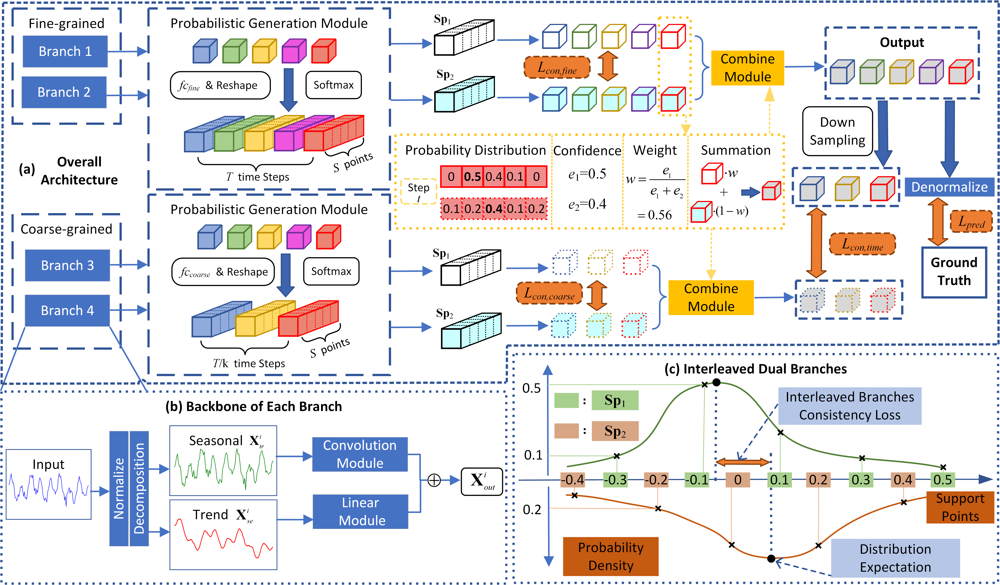
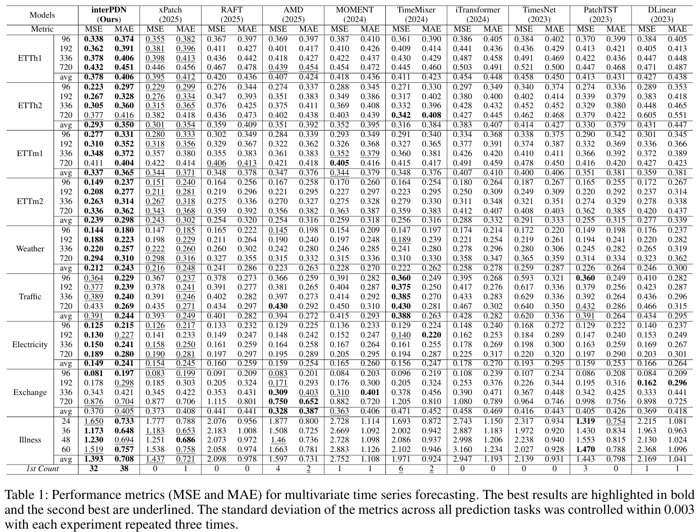

<div align="center">
  <h2><b> (AAAI26) Time Series Forecasting via Direct Per-Step Probability Distribution Modeling </b></h2>
</div>

<div align="center">


</div>

This is an official implementation of [Time Series Forecasting via Direct Per-Step Probability Distribution Modeling].

## Model Overview

We employ a base model based on trend-seasonality decomposition.
The output head of the base model is modified to produce per-step **discrete probability distribution** over a predefined support set.

**Interleaved dual branches**: Two non-shared branches output probability distributions over interleaved support sets, with a consistency constraint applied between them.

**Coarse-scale guidance**: The interleaved dual-branch architecture is replicated at coarser temporal scales, serving as an additional self-supervised signal to guide long-term trend forecasting at regular scales.

<p align="center">

</p>

## Results

We provide below the results of multivariate time series forecasting on nine real-world datasets after hyperparameter search.
Our method outperforms state-of-the-art approaches on most forecasting tasks.

<p align="center">

</p>

## Getting Started

1. Install conda environment: ```conda env create -f environment.yml```

2. Download data. You can download the datasets from [Google Driver](https://drive.google.com/u/0/uc?id=1NF7VEefXCmXuWNbnNe858WvQAkJ_7wuP&export=download), [Baidu Driver](https://pan.baidu.com/share/init?surl=r3KhGd0Q9PJIUZdfEYoymg&pwd=i9iy) or [Kaggle Datasets](https://www.kaggle.com/datasets/wentixiaogege/time-series-dataset). All datasets are pre-processed and can be used easily. Create a seperate folder ```./dataset``` and put all the files in the directory.

3. Train the model. We provide the experiment scripts of all benchmarks under the folder `./scripts`. The script for hyperparameter search is *interPDN_search*. Take ETTh1 dataset as example, you can reproduce the experiments by:

```
bash ./scripts/interPDN_search/ETTh1.sh
```

If you wish to reproduce the results on 4 ETT datasets when the base model is replaced with DLinear, you can run:

```
bash ./scripts/DLinear/ETTh1.sh
```

## Acknowledgement

We appreciate the following github repos for their valuable code and effort:
- DLinear (https://github.com/cure-lab/LTSF-Linear)
- xPatch (https://github.com/stitsyuk/xPatch)
- Time-Series-Library (https://github.com/thuml/Time-Series-Library)
- RevIN (https://github.com/ts-kim/RevIN)

## Contact

If you have any questions or concerns, please contact us at leonardokong486@gmail.com or submit an issue.
